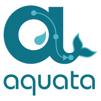
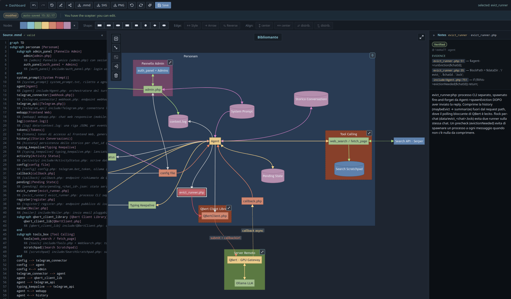

<p align="center">
  
</p>

<p align="center">
  <strong>Mermaid diagrams as a shared language between humans and AI coding agents.</strong>
</p>

Aquata is a self-hostable web app that stores [Mermaid](https://mermaid.js.org/) diagrams and exposes them to AI agents over [MCP](https://modelcontextprotocol.io/) (Model Context Protocol). Humans edit diagrams in a rich visual editor; agents read and write the same diagrams through a clean semantic interface. Neither side has to put up with the other's format.



## Why

When you reason about software with an AI agent, words alone are often not enough — diagrams are the natural shared medium. But humans and LLMs want opposite things from a diagram:

- an **LLM** wants clean semantics: stable IDs, explicit intent, no visual noise;
- a **human** wants readability: position, colour, grouping, emphasis.

Mixing the two (inline `style` directives, meaning carried only by colour or placement) degrades both. Aquata separates them:

- **Mermaid source = semantic layer.** Stable element IDs, per-element notes (`%% [id] text`) that record authorial intent, no orphans, no presentation noise. This is what agents read and write via MCP.
- **Layout JSON = presentation layer.** Positions, per-element colours, custom palettes, collapsed subgraph "capsules". The web editor manages it; agents never see it.

On top sits the **grounding protocol**: per-element notes are not mere descriptions — they are *contracts about the code*. An agent can verify each note against the actual codebase and mark it `verified` or `contradicted`, backed by an evidence receipt (file reference + literal quote) cryptographically bound to the note text. Diagrams stop being documentation that rots; they become a maintained, verified source of truth.

## Features

- **Visual editor** — selection-driven toolbar (Figma-style), drag positioning, per-type custom palettes, collapsible subgraph capsules, multi-select, zoom-aware selection halo. Vanilla JS, CodeMirror + Mermaid from CDN.
- **MCP server** — Streamable HTTP endpoint (`/mcp`) with Bearer-token auth. Tools: `list_diagrams`, `get_diagram`, `create_diagram`, `save_diagram`, `delete_diagram`, `get_layout`, `set_layout`, `set_note`, plus the grounding flow (`prepare_save`, `commit_save`, `set_grounding`) and a canonical `ground` prompt.
- **Revision history** — immutable revision DAG: undo/redo across sessions and devices, branching, no destructive operations.
- **Collaboration** — turn-based edit locking with live viewers, edit handover requests, per-diagram sharing (view/edit), merge requests, projects (folders), presence indicators.
- **Multi-user SaaS-ready** — self-service signup with email verification, per-user quotas, rate limiting, login lockout, security headers (CSP, HSTS).
- **i18n** — 9 languages: English, Italian, French, German, Spanish, Portuguese, Chinese, Japanese, Korean.
- **Zero-dependency stack** — plain PHP 8.3+, no Composer, no framework, no build step. SQLite by default, MySQL/MariaDB supported. Runs on any LAMP host, including jailed shared hosting.

## Requirements

- PHP **8.3+** with `pdo`, `pdo_sqlite` (or `pdo_mysql`), `json`, `mbstring`, `openssl`
- Apache with `mod_rewrite` (or any server that routes everything to `index.php`)
- A writable `data/` directory (SQLite database, caches)
- The editor loads CodeMirror and Mermaid from CDN, so browsers need internet access

## Quick start

```bash
git clone https://github.com/neocerebrum/Aquata.git
cd Aquata
cp .env.example .env        # defaults are fine for a local try
php scripts/seed_admin.php  # create the first admin user (interactive)
php -S localhost:8080 scripts/dev_router.php
```

Open `http://localhost:8080` and log in.

For production, point an Apache vhost at the project root (the bundled `.htaccess` handles rewriting and denies access to `app/`, `data/`, `scripts/`, `docs/` and dotfiles), set `APP_URL`, `APP_FORCE_HTTPS=true` and a real `MAIL_TRANSPORT` in `.env`, and switch `DB_DRIVER=mysql` if you prefer MariaDB/MySQL. The schema is created and migrated automatically on first request (`app/Schema.php`).

> **Note for MySQL/MariaDB:** the app expects the DB session to run in UTC (`time_zone='+00:00'`, set automatically on connect).

### Deploying to shared hosting

Aquata runs fine on plain shared hosting where your only access is FTP — no git, no SSH, no Composer needed. Just upload the whole tree to the web root with any FTP client (skip `data/`, `docs/`, `.env*`, `deploy.sh`, `.deploy-config*`), then create `.env` on the server.

The bundled `deploy.sh` automates this. Put your FTP credentials in `.deploy-config` (gitignored, never uploaded):

```bash
cp .deploy-config.example .deploy-config   # then edit: FTP_HOST, FTP_USER, FTP_PASS, FTP_REMOTE_DIR
./lint.sh && ./deploy.sh --all             # full upload — or ./deploy.sh <file1> [file2 ...]
```

It uploads only application files, automatically excluding local-only ones (`.env*`, `data/`, `docs/`, the deploy tooling itself).

If you lose all admin access, `scripts/reset_password.php <email>` is the CLI escape hatch.

## Connecting an AI agent (MCP)

1. In Aquata, go to **Profile → API tokens** and create a token.
2. Register the server with your agent — e.g. for Claude Code:

```bash
claude mcp add --transport http aquata https://your-host/mcp \
  --header "Authorization: Bearer <your-token>"
```

The agent can then list, read, create and save diagrams. The Mermaid source it receives is the pure semantic layer — layout and styling are stored separately and never pollute it.

→ **New here? Follow [`docs/getting-started.md`](docs/getting-started.md)** — account → token → MCP → first diagram → grounding, end to end.

### Grounding

Per-element notes (`%% [id] text`) carry intent — *why* an element exists, what contract it represents. The `ground` MCP prompt walks an agent through verification: read the code, collect `{ref, quote}` evidence for each note, and record a verdict (`verified` / `contradicted`) via `prepare_save` → `commit_save` (or `set_grounding` for an unchanged diagram). The server never sees your code — it only enforces the receipt's form and binds it to the note by hash. Verdict freshness is visible in the editor, so stale or broken contracts are immediately apparent.

See [`docs/grounding.md`](docs/grounding.md) for the full protocol: the receipt format, the noteHash binding, the verification gate, and the prepare/commit/set-grounding flows.

## i18n

Translations live in `lang/{en,it,fr,de,es,pt,zh,ja,ko}.php` as flat arrays with dot-notation keys. To add a language, create `lang/xx.php` with all keys and add `'xx'` to `I18n::SUPPORTED` (`app/I18n.php`). Language detection: `aquata_lang` cookie → `Accept-Language` header → English fallback.

## Architecture notes

See [`docs/DESIGN.md`](docs/DESIGN.md) for the design decisions: revision DAG persistence, turn-based concurrency model, sharing/permission model, and why there is deliberately no real-time CRDT editing.

## Contributing

See [`CONTRIBUTING.md`](CONTRIBUTING.md). All code, comments and documentation are in English; only `lang/*.php` files contain non-English text.

## Security

Please report vulnerabilities privately — see [`SECURITY.md`](SECURITY.md).

## License

[GNU AGPL-3.0](LICENSE). Copyright © 2026 Lamberto Tedaldi (Neocerebrum.ai).

You are free to use, study, modify and self-host Aquata. If you offer a modified version of it to others as a network service, the AGPL requires you to make your modified source available to its users.
