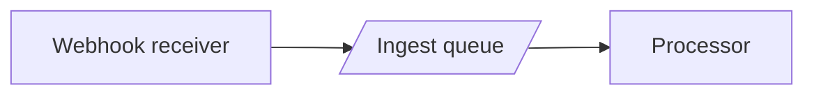

# Getting started: your first diagram with an AI agent

Nixie Flow supports two complementary workflows:

- **Document existing code** — point the agent at a codebase, have it draw the structure, and ground the notes against the code. The diagram becomes living, verified documentation.
- **Design before you write** — start from a blank canvas and co-design the structure with the agent as a diagram with intent notes, argue about it until you both agree, and only *then* write code against it. Grounding runs forward, turning the diagram into a live acceptance contract.

This guide sets up the first workflow end to end (steps 1–7), then shows the second with a worked example ([Design-first](#design-first-agreeing-on-the-structure-before-writing-code)). It assumes you have an Nixie Flow instance running (see the [README](../README.md) for setup) and uses [Claude Code](https://claude.com/claude-code) as the agent — any MCP-capable client works the same way.

## 1. Create an account

Open your instance and sign up (or log in). Self-service signup may require email verification depending on the instance config.

## 2. Create an API token

The agent authenticates to Nixie Flow with a bearer token, separate from your browser session.

1. Go to **Profile → API tokens** (`/profile/tokens`).
2. Create a token with a label (e.g. *"claude-code laptop"*).
3. Copy the token shown — it starts with `aqt_` and is displayed **once**. Store it like a password; you can't retrieve it later, only revoke and re-issue.

## 3. Register the MCP server

Point your agent at the Nixie Flow MCP endpoint (`/mcp`), passing the token as a bearer header. For Claude Code:

```bash
claude mcp add --transport http nixieflow https://your-host/mcp \
  --header "Authorization: Bearer aqt_your_token_here"
```

The token-creation page also shows a ready-to-paste config snippet for clients that take JSON. Verify the connection — the agent should now list Nixie Flow's tools (`list_diagrams`, `get_diagram`, `create_diagram`, `prepare_save`, `commit_save`, `set_grounding`, `set_note`, `get_flows`, `set_flows`, …) and the `ground` prompt.

## 4. Have the agent draw a diagram

Ask the agent, in plain language, to map something. For example:

> Map the request flow of this service as an Nixie Flow diagram. Use a Mermaid flowchart, give every node a stable id, and add a `%% [id]` note to each one describing what it's responsible for.

The agent calls `create_diagram` with a Mermaid flowchart. A few conventions Nixie Flow expects (the tool descriptions remind the agent of these):

- **Flowcharts only** (`flowchart`/`graph TD|LR|…`). Sequence/class/ER diagrams aren't supported by the editor.
- **No styling in the source** — no `style`, `classDef`, or per-node colours. Visual styling lives in the layout layer, which you control in the editor.
- **Notes carry intent** — `%% [<id>] <text>`, one per node/subgraph. These are the contracts grounding will later verify.

## 5. Open it in the editor

Open the diagram in the browser. This is *your* side of the bridge:

- **Drag** nodes to lay the graph out the way it reads best.
- **Colour** nodes/subgraphs/edges from the contextual palette (double-click a swatch to edit presets, or use the eyedropper).
- **Collapse** a subgraph into a compact capsule to tame a busy area.
- Edit notes in the **notes panel** when you want to refine intent yourself.
- **Define flows** in the **Flows** tab — select a series of edges in order, name the flow, and play it back as a step-by-step animation that lights up each edge in sequence.

None of this touches the Mermaid source the agent sees. Positions, colours and capsule state are stored in the layout sidecar — when the agent re-saves the source, your arrangement is preserved automatically.

## 6. Ground it against the code

This is where the diagram becomes a maintained source of truth. From inside the repo the diagram describes (so the code is reachable), invoke the `ground` prompt:

```
/ground your-diagram-slug
```

The agent will pin the current commit, read each `%% [id]` note, find the code it refers to, and record a verdict — `verified`, `contradicted`, `unverified`, or `n/a` — backed by literal `{ref, quote}` evidence. The verdicts appear in the editor's notes panel, colour-coded, so you can see at a glance which contracts still hold.

See [grounding.md](grounding.md) for the full protocol.

## 7. The loop

From here it's a cycle:

1. You and the agent reason over the diagram instead of only over text.
2. The agent edits the source (`prepare_save` → `commit_save`), preserving and updating notes.
3. You re-arrange and colour for readability in the editor.
4. Re-grounding flags any note the code has drifted away from.

The diagram stays readable for you and clean for the agent, and grounding keeps it honest about the code. That's the whole point of Nixie Flow.

## Flows: tracing execution paths

A **flow** is an ordered sequence of edges that plays back as an animation in the editor — each edge lights up in turn, letting you follow a data or control path through the diagram.

You can define flows yourself in the **Flows** tab (select edges in order, click **Add flow**, name it). But you can also ask the agent to generate them from code analysis — this is where flows become genuinely useful as a bridge between the agent's understanding and what you see in the editor.

For example:

> Read the `my-service` diagram and create a flow called "happy path" that traces the sequence of edges a typical request follows, in order.

The agent calls `get_diagram` to read the structure, reasons over the code, then calls `set_flows` to write the flow. When you open the **Flows** tab and press play, you see the path it identified, animated edge by edge.

You can have multiple flows on the same diagram — "happy path", "error path", "auth bypass", "cache hit" — each highlighting a different subset of edges. Flows defined by you are preserved when the agent writes new ones (upsert by name); pass `null` for a name to delete it.

The agent can also read flows you've already defined (`get_flows`), so it can build on your intent when you say things like "check that this flow is still valid after the refactor" or "add the retry edges to the error path flow".

## Design-first: agreeing on the structure before writing code

The walkthrough above documents code that already exists. The other way to use Nixie Flow is the reverse, and it's where the diagram does its most interesting work: **the diagram comes first, as the design you and the agent agree on before a line of code is written.**

Say you're adding a webhook ingestion pipeline.

**1. Sketch the intent.** Start a diagram and write notes that say what you *want*, not what exists. A few nodes is enough:



You can draw this in the editor, or ask the agent to scaffold it from a description — either way, it's a sketch of *intent*, not a map of code.

**2. Discuss it with the agent.** Ask it to read the design and push back on it:

> Read the `webhook-pipeline` diagram. Does this handle retries and duplicate deliveries correctly? What's missing?

The agent fetches it with `get_diagram`, critiques the contracts in the notes (*"the receiver returns 200 before the event is durably queued — a crash between the two loses the webhook"*), and proposes changes. It can edit nodes and notes directly (`set_note`, `prepare_save` → `commit_save`) or suggest and let you decide.

**3. Iterate — both sides.** You re-arrange and refine notes in the editor for the way *you* think about it; the agent fills gaps, flags "ghosts" (components the design implies but doesn't show), and tightens each note into a precise contract. The structure sharpens into a spec that reads well to both of you.

**4. Converge.** When the diagram convinces *both* of you — every node carries a clear, agreed contract — the design phase is done. **Nothing has been written yet.** That's the point: you front-loaded the disagreements into the cheap medium.

**5. Now write the code, against the diagram.** As each piece lands, ground it:

```
/ground webhook-pipeline
```

Here grounding runs *forward*. A note flips from grey to `verified` when the code fulfils its contract, and to `contradicted` when the implementation diverged from what you agreed. The diagram becomes a live progress board against the blueprint: **grey = not built yet, green = built as designed, red = drifted from the design.**

The diagram precedes the code and outlives the conversation. It's the artifact you both committed to — and grounding keeps the code honest to it instead of the other way around.

## Troubleshooting

- **Agent can't see the tools** — check the token is valid (not revoked) and the URL ends in `/mcp`. The MCP endpoint speaks JSON-RPC over HTTP with bearer auth; a 401 means the token header is missing or wrong.
- **"locked: another user is editing"** — Nixie Flow uses turn-based locking. The agent auto-acquires the lock on save if it's free; if a human holds it, wait or take the turn in the editor.
- **A save returns a conflict** — the diagram moved since the agent last read it. Re-fetch with `get_diagram` (or re-run `prepare_save`) to get the current `revision_id` and retry.
