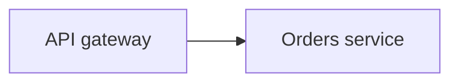

# The grounding protocol

Grounding is what makes Nixie Flow diagrams *maintained* instead of decorative. It is the feature that turns a per-element note from a comment into a **verifiable contract about the code** — and gives both you and an AI agent a way to tell, at a glance, whether that contract still holds.

This document is the reference for how grounding works: the data model, the verification gate, and the tools an agent uses to record verdicts.

- [The problem](#the-problem)
- [Notes are contracts](#notes-are-contracts)
- [Verdicts](#verdicts)
- [The receipt](#the-receipt)
- [noteHash: binding a verdict to a note](#notehash-binding-a-verdict-to-a-note)
- [The gate: what the server enforces](#the-gate-what-the-server-enforces)
- [Where verdicts live](#where-verdicts-live)
- [The flows](#the-flows)
- [The `ground` prompt](#the-ground-prompt)
- [Design principles](#design-principles)

## The problem

LLM-generated diagrams are usually write-once. An agent draws your architecture, you glance at it, and it rots in a README while the code moves on. Six months later nobody trusts it, because nobody can tell which parts are still true.

Grounding attacks exactly this. A note on a diagram element is a claim about the code (*"this gateway validates the JWT before any downstream call"*). Grounding is the act of **checking that claim against the actual code** and recording a verdict that is cryptographically bound to the note text. When the note changes, the verdict is automatically invalidated. When the code drifts, re-grounding flips the verdict to `contradicted`. Stale contracts become visible instead of silent.

## Notes are contracts

A note is a Mermaid comment attached to a node or subgraph id:

```
%% [<id>] <text>
```

- One line per id, placed right after the element's declaration. At most one note per id.
- The brackets make it unambiguous: a `%%` line whose first token isn't a bracketed id is an ordinary comment, never a note. (The legacy bare form `%% <id> <text>` is still recognised for back-compat.)
- Multi-line notes are encoded inline: a literal newline becomes `\n` (backslash + n), a literal backslash becomes `\\`.
- Mermaid ignores `%%` lines, so notes never affect the rendered diagram.

Example:



These notes are what an agent reads via `get_diagram` to recover authorial intent, and what it preserves when it rewrites the source. They are the unit grounding operates on.

## Verdicts

Each grounded id carries one status:

| Status | Meaning | Evidence required |
|---|---|---|
| `verified` | The note's claim is true; the code backs it. | **Yes** |
| `contradicted` | The note's claim is false; the code disagrees. | **Yes** |
| `unverified` | Not checked, or the code is unreachable from here (separate repo, external API). | No |
| `n/a` | The note makes no verifiable code claim (e.g. a UI preference). | No |

Grey (`unverified`/`n/a`) is always free — the gate never forces you to verify anything. It only constrains what it means to claim `verified` or `contradicted`.

## The receipt

A verdict for an id is a JSON record:

```json
{
  "status": "verified",
  "evidence": [
    { "ref": "src/gateway/auth.ts:42-58", "quote": "verifyJwt(req.headers.authorization)" }
  ],
  "noteHash": "9f2c…64-hex-chars…1a",
  "checkedAtCommit": "a1b2c3d",
  "verifier": "claude",
  "checkedAt": "2026-06-11T10:00:00Z"
}
```

- **`evidence`** — a list of `{ref, quote}` items. Required and non-empty for `verified`/`contradicted`; ignored for `unverified`/`n/a`.
  - `ref` must match `^[A-Za-z0-9._/-]+:[0-9]+(-[0-9]+)?$` — a path plus a line or line range (`path/to/file.ts:42` or `:42-58`).
  - `quote` must be a **literal substring** of the code at that ref. This is the actual proof: the server can't read your code, so the truth of a verdict rests on this quote check, which you perform client-side.
- **`noteHash`** — sha256 of the note text (see below). Required for `verified`/`contradicted`; it binds the verdict to the exact note it was made against.
- **`checkedAtCommit`, `checkedAt`, `verifier`** — optional provenance, stored as-is when present.

## noteHash: binding a verdict to a note

The `noteHash` is what makes a verdict fall apart the instant the note changes. It is computed from the note's text by a fixed canonicalization:

1. **Decode** the inline encoding: `\n` → newline, `\\` → backslash.
2. **Collapse** every run of whitespace to a single space.
3. **Trim** leading/trailing whitespace.
4. **sha256** the result, as lowercase hex.

Both sides compute it the same way (the editor in JS, the server in PHP), so they always agree. Because the hash is over the *canonical* text, cosmetic reformatting (re-wrapping, extra spaces) doesn't break a verdict — but any change to the actual wording does.

When you mark a note `verified`, you send the `noteHash` of the note as it appears in the source you're committing. The server recomputes that hash from the source and rejects the receipt unless they match. A stale "verified" — one whose note text has since changed — cannot be smuggled through.

## The gate: what the server enforces

**The server never sees your code.** It cannot check whether a quote is true. What it *can* do, and does, is enforce the **form** of a receipt and its **binding** to the note:

For every entry in a submitted grounding map, the server checks:

1. The key is a valid node id (`^[A-Za-z0-9_]+$`).
2. `status` is one of `verified | contradicted | unverified | n/a`.
3. For `verified`/`contradicted`:
   - at least one `{ref, quote}` evidence item, each `ref` matching the pattern and each `quote` a non-empty string;
   - a `noteHash` that is 64 hex chars **and** equals the server's hash of that id's note in the source being committed;
   - a note actually exists in the source for that id.
4. For `unverified`/`n/a`: evidence and noteHash are optional and not constraining.

Any violation rejects the **whole** call with a specific error. The truth of each quote is yours to establish; the server guarantees only that a green verdict is well-formed and bound to the note text it claims to be about.

## Where verdicts live

Grounding is stored in the **layout sidecar** (the JSON that also holds positions, styles, palettes), under a `grounding` key — *not* in the Mermaid source. This keeps the source clean for the agent:

- `get_diagram` returns the source **and** the grounding verdicts, but deliberately **not** the rest of the layout (positions/styles are noise for an LLM).
- On any source-only re-save, the layout — grounding included — is **carried over automatically**. The agent never sends layout.
- Entries are **pruned**: when a note disappears from the source, its grounding entry is dropped, so orphans never accumulate.
- Entries are **merged**, not replaced (see below).

## The flows

There are three ways to record verdicts and one way to edit a note, all over MCP.

### Re-verifying unchanged source — `set_grounding`

The source hasn't changed; you've re-checked the notes against newer code. Send the verdicts directly:

```
set_grounding(slug, expected_version, grounding)
```

Verdicts **merge** onto what's already there: send only the ids you re-checked; every other note keeps its current verdict. No new snapshot — it updates the working copy in place.

### Changing the source — `prepare_save` → `commit_save`

When you rewrite the Mermaid (new nodes, edited notes), grounding is gated in two steps:

```
prepare_save(slug, source, expected_version)
   → { token, requires_grounding: [ids…], ttl_seconds: 900 }
```

`prepare_save` stages your new source under a short-lived token and tells you exactly which notes are **new or changed** since the current revision — i.e. the notes whose verdicts can't carry over and must be re-grounded. It creates no snapshot and changes nothing.

You then ground those notes (read the code, collect `{ref, quote}` evidence at the pinned commit) and finalize:

```
commit_save(token, grounding[, message])
```

`commit_save` validates the receipts against the **staged** source, merges them onto the existing grounding, and creates the snapshot — with the same optimistic-concurrency check as a normal save (if the base moved under you, the token is dropped and you re-run `prepare_save`).

Receipts you omit keep their current verdict. The one automatic exception: a previously green note whose text you changed has its now-stale verdict dropped unless you re-ground it.

`save_diagram` still exists for plain saves with no grounding, but `prepare_save` → `commit_save` is preferred whenever you want verdicts recorded alongside the change.

### Editing a single note — `set_note`

To set or clear one element's note without resending the whole source:

```
set_note(slug, id, text, expected_version)
```

Because the note *is* the contract, changing its text invalidates any prior `verified`/`contradicted` for that id (the noteHash no longer matches) — the verdict drops to grey. `set_note` can only ever **clear** a verdict, never set one, so it can't bypass the gate.

### Merge semantics

Across all flows, `mergeGrounding` is the rule that keeps re-grounding cheap and honest:

- An existing `verified`/`contradicted` is carried over **only while its noteHash still matches** the note in the new source. A changed note's verdict is dropped.
- `unverified`/`n/a` and still-matching green verdicts are kept.
- An incoming receipt wins on conflict.
- A verdict for a note that no longer exists is dropped.

So you only ever need to send receipts for the notes that actually changed; the rest stay put, and nothing stale survives.

## The `ground` prompt

The server ships a canonical MCP prompt named `ground` that walks an agent through the whole procedure — pin the commit, fetch the diagram, anchor each note to code, read it, assign a verdict, collect literal-quote evidence, compute the noteHash, and write via `set_grounding` or `prepare_save` → `commit_save`. It also asks the agent to list "ghosts" (code with no node in the diagram) as a hint for missing coverage.

From a connected agent (e.g. Claude Code), invoke it by name with the diagram slug:

```
/ground bibliomante      # or: use the "ground" prompt with slug=bibliomante
```

Run it from inside the repo the diagram describes (cwd = repo root), so the code the notes reference is reachable.

## Design principles

- **The server is a referee, not a witness.** It never sees your code; it enforces a receipt's form and its binding to the note, and nothing else. Truth is established by a mechanical quote check on the client.
- **A note is true only if checked.** A verdict that reads well but fails the literal-quote check is not allowed to be green. Grey is the honest default.
- **Changing a contract voids its guarantee.** Bind verdicts to note text by hash, so editing the note can never silently keep an old "verified".
- **Presentation never pollutes meaning.** Verdicts live in the layout sidecar with positions and colours; the Mermaid source the agent reads stays pure semantics.
